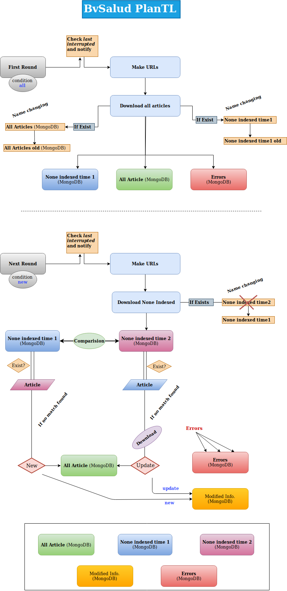

# BvSalud PlanTL

## INTRODCTION
BvSalud PlanTL is a project to download all articles from [bvsalud](http://pesquisa.bvsalud.org/portal/), LILACS and IBECS and save into the MongoDB. As you will have noticed, they have millions of article.
Downloading all articles, always, is a waste of time, when we can just download not existing in our DATABASE.

### REQUERIMENT

`$ cd BvSalud`

`$ pip install -r requirements.txt`

**If you are getting problem with any library while installing requirements, so you can install id individually**

- **BeautifulSoup:**

    `pip: $ pip install beautifulSoup`
    
    
- **pymongo:**

    `pip: $ pip install pymongo`

## TUTORIAL CRAWLER
If you are going to excecute this program for the first time or you don't have any data in MongoDB than you must pass the condition (argument) -m/--mode \[all\] and also a argument for output folder -o/--output folder_name.
Otherwise, you must pass the condition (argument) -m/--mode \[new\].

All data download will be saved in the directory /home/user_name/bvSalud_downloads/sub_folder (sub_folder is the argument that you pass it (-o/--output  \[folder name\])).
If the folder already exits, it will delete it and make a new.

### How to download:
```bash
$ git clone https://github.com/ankush13r/BvSalud.git
```

```bash
$ cd BvSalud
```
### - First time:
```bash
$ python bvs -m/--mode 'all' -o/--output 'folder_name' 

```

For first time you have to run it with the argument **"all"**. It will download all articles to you MongoDb in DB **bvs** and collection **training_collection_All**, even it will create the collection **training_collection_None_Indexed_t1** with all none_indexed articles.
    
**Result (MongoDB):**

- **bvs** *(DB)*:
    - **all_articles** *(Collection)*:  This collection will contain all articles.
    - **none_indexed_t1** *(Collection)*:  This collection will just contain none indexed articles.
    - **errors_training** *(Collection)*: Save all errors occurred while saving.

       ---------------------------------------------------- 
### - All next time:
```bash
$ python bvs -m/--mode 'new' -o/--output folder_name 

```
The next rounds are just for new articles, not available in MongoDB. In these rounds program will compare all none indexed article if they have been indexed or there is any new article. 
After all it will save all new article directly and those that have been indexed will update in the collection all articles.

**Make sure it's not the first time.**


**Result (MongoDB):**
- **bvs** *(DB)*:
    - **all_articles** *(Collection)*:  This collection will contain all articles, new arrived and old.
    - **none_indexed_t1** *(Collection)*:  This collection just containts old none indexed. 
    - **none_indexed_t2** *(Collection)*:  This collection will contain all new and old none indexed.
    - **Update_info** *(Collection)*: This collection saves information about none indexed articles, if those are new or just have been updated to indexed, and also save the date.
    - **errors_training** *(Collection)*: Save all errors occurred while saving. 

### - JUST COMPARE: 
**If you already have *none_indexed_t1* and *none_indexed_t2*, and just need to compare and update collection *all_articles*.**

```bash
$ python bvs -m/--mode 'compare'

```
With mode "compare" you are just comparing time1 and time2 none indexed collection. And updating all articles collection depending on if there are any new article or modified.

### - RESTART from the last failed to finish it: 
**If the program has been *failed* while dowinloading or saving your records or just want to restart from last time stopped.**
```bash
$ python bvs -m/--mode 'must be same as last time' -o/--output 'must be same as last time' --restare

```
With argument --restart the program will find last stop and start from that point. **Warning:** **-m/--mode** and **-o/--output** must be 


## TUTORIAL testSet:
```bash
$ cd BvSalud
```

```bash
$ python tesSet.py -y 'year' -o output_file_name.json

```

The program is to make a json file for all **none indexed articles**. Those article that has been select, will be update by new row **{selected: true}**, in mongoDB, collection all_articles.

*-y 'yyyy'*: all articles will be greater o equal than year received by argument.

*-o 'output_file_name.json'*: A file_name to create a json file with article selected.

-----------------------------------------------------------------------
## TUTORIAL goalSet:
```bash
$ cd BvSalud
```

```bash
$ python goalSet.py -y 'year' -o output_file_name.json

```

The program is to make a json file for all **indexed articles** that have **{selected: true}**.

-y 'yyyy': all articles will be greater o equal than year received by argument.

-o 'output_file_name.json': A file_name to create a json file with article selected.


## PIPILINE



 
For more information contact:* *ankush.ran13@gmail.com*


